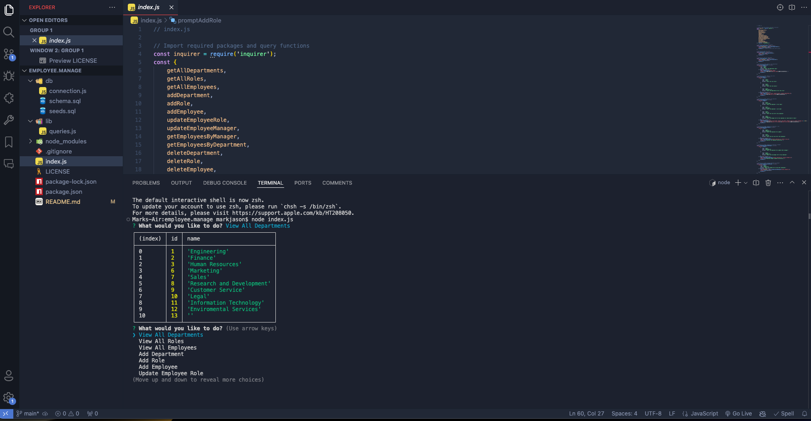
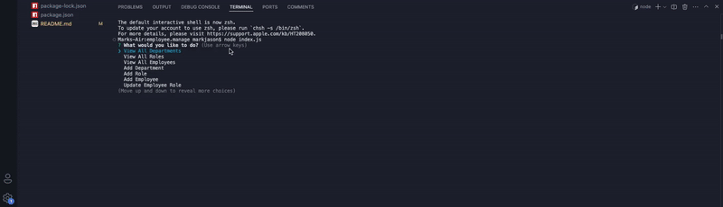

# Employee Management System

## Description

The Employee Management System is a command-line application built using Node.js, Inquirer, and PostgreSQL. It allows business owners to manage and organize their company's departments, roles, and employees efficiently. With this application, users can view and manage the company's departments, roles, and employees, ensuring smooth operations and planning.




## Table of Contents

- [Installation](#installation)
- [Usage](#usage)
- [Features](#features)
- [Walkthrough Video](#walkthrough-video)
- [Database Schema](#database-schema)
- [Contributing](#contributing)
- [License](#license)
- [Questions](#questions)

## Installation

To install and set up the project, follow these steps:

1. **Clone the repository:**
   ```bash
   git clone https://github.com/your-username/employee-management-system.git
2. **Navigate to the project directory:** 
    ```bash
    cd employee-management-system
3. **Install the necessary dependencies:**
    ```bash
    npm install
4. **Set up the PostgresSQL database:**
-   Create the Database:
      ```bash
    psql -U your_username -c "CREATE DATABASE employee_management;" 

-   Create the tables:
     ```bash
    psql -U your_username -d employee_management -f db/schema.sql

- Seed the database with the initial data:
    ```bash
    psql -U your_username -d employee_management -f db/seeds.sql
5. **Update the database connection details:**
    - Edit the db/connection.js file with your PostgreSQL username and password.

6. **Run the application**:
    ```bash
    node index.js

## Usage
After starting the application, you will be presented with a menu of options:
- View All Departments
- View All Roles
- View All Employees
- Add Department
- Add Role
- Add Employee
- Update Employee Role

Use the arrow keys to navigate through the options and select the desired action. Follow the prompts to view data or add/update records in the database.

## Features


- View All Departments: Displays a table with department names and IDs.
- View All Roles: Displays job titles, role IDs, department names, and salaries.
- View All Employees: Displays employee details, including IDs, names, job titles, departments, salaries, and managers.
- Add Department: Allows you to add a new department to the database.
- Add Role: Allows you to add a new role with a title, salary, and department.
- Add Employee: Allows you to add a new employee with a name, role, and manager.
- Update Employee Role: Allows you to update an employee's role in the database.

## Walkthrough Video
CLICK [[here]](https://youtu.be/shN8GHjoxYw?si=naEqoTqdUIa6Drt_)

## Database Schema

The database schema consists of three tables:

1.  **Department**:
    - `id`: SERIAL PRIMARY KEY
    - `name`: VARCHAR(30) UNIQUE NOT NULL
2. **Role**:
    - `id`: SERIAL PRIMARY KEY
    - `title`: VARCHAR(30) UNIQUE NOT NULL
    - `salary`: DECIMAL NOT NULL
    - `department_id`: INTEGER NOT NULL REFERENCES department(id)
3. **Employee**:
    - `id`: SERIAL PRIMARY KEY
    - `first_name`: VARCHAR(30) NOT NULL
    - `last_name`: VARCHAR(30) NOT NULL
    - `role_id`: INTEGER NOT NULL REFERENCES role(id)
    - `manager_id`: INTEGER REFERENCES employee(id)

## License

This project is licensed under the MIT License. See the LICENSE file for details.

## Contact
- github: markjas0n
- email: [markjas0n@icloud.com](markjas0n@icloud.com)